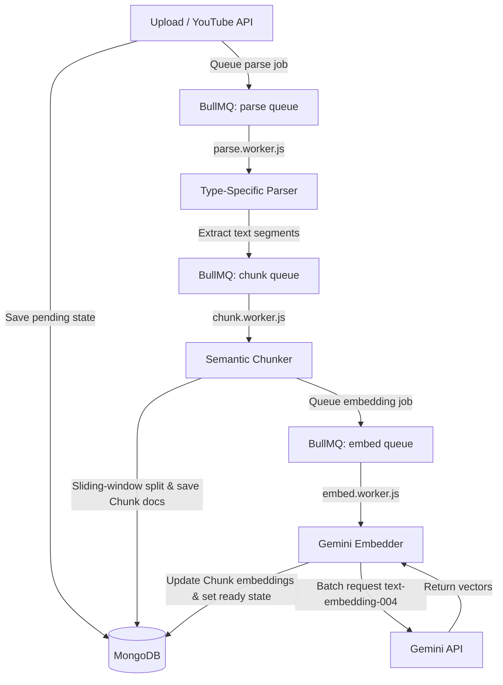
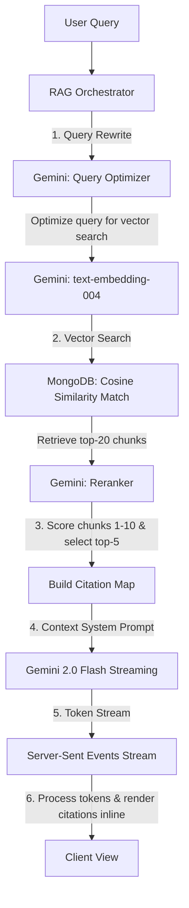

# 🧠 ContextLLM

ContextLLM is a state-of-the-art SaaS document intelligence platform and NotebookLM clone. It empowers users to upload multi-format sources (PDFs, YouTube playlists, transcripts, text documents, and web links), automatically parse and semantically chunk them, and query their workspace in real-time. Responses from the Gemini-powered chat include exact inline citations that map back to the visual sources, with direct timestamp seeking for video playback.

---

## 🚀 Key Features

* **Multi-Format Ingestion Pipeline**: Ingest PDFs, `.vtt` subtitles, raw text, web links, and YouTube videos or entire playlists.
* **Semantic Vector Search**: Automatically parses documents, applies semantic sliding-window chunking (with 15% overlap), and generates embeddings using Gemini's `text-embedding-004` model.
* **Interactive Chat Workspace**: Converse with your documents in real-time via a persistent, streaming Server-Sent Events (SSE) RAG chat.
* **Exact Inline Citations**: Clickable citations `[1]`, `[2]` in responses overlay matching text segments and open the original source panel.
* **Auto-Seeking YouTube Player**: YouTube citations open the video player at the exact timestamp of the cited segment.
* **Knowledge Graph Visualization**: Render interactive nodes and connections mapping source relationships based on shared semantics.
* **Workspace Notes**: Sticky notes workspace in each notebook to write summaries and store insights.
* **Security & Auth**: Email/Password and Google OAuth 2.0 flows, protected route middleware, and token-based sessions.

---

## 🛠️ Technology Stack

| Layer | Technologies |
|---|---|
| **Frontend** | React, React Router 6, Tailwind CSS, Lucide Icons, Canvas API (Force-Directed Graph) |
| **Backend API** | Node.js (ES Modules), Express 5, Passport.js, Zod (Validation), Winston (Logging) |
| **Database** | MongoDB Atlas (Mongoose ODM) |
| **Cache & Queue** | Redis, BullMQ (Ingestion Task Queue) |
| **AI / LLM** | Google Gemini 2.0 Flash (Streaming API), Gemini `text-embedding-004` |
| **Storage** | Cloudinary (Signed file uploads) |

---

## 📐 System Architecture

### 1. Ingestion Pipeline (Asynchronous Fan-out)

When a source is added, the server records the document state as `pending` and pushes it to a BullMQ Redis queue. Persistent workers process the document through a three-stage pipeline:



### 2. RAG Chat & Citation Generation Pipeline

When a query is submitted, ContextLLM executes a retrieval-augmented generation (RAG) pipeline to fetch matching text, rerank matches, and stream citations:



---

## 📂 Repository Structure

```text
contextllm/
├── client/                 # React Frontend
│   ├── src/
│   │   ├── components/     # ProtectedRoute, PublicRoute, ProcessingStatus
│   │   ├── contexts/       # AuthContext (Persisted logins)
│   │   ├── pages/          # LandingPage, LoginPage, DashboardPage, NotebookPage
│   │   └── lib/            # Axios API wrappers
│   └── vercel.json         # Vercel SPA Routing Configuration
│
└── server/                 # Express Backend & Queue Worker
    ├── src/
    │   ├── config/         # Database, Redis Proxy, Env schema
    │   ├── integrations/   # Gemini, Cloudinary clients
    │   ├── middlewares/    # Rate limiters, Error handlers, Owner scopes
    │   ├── modules/        # Auth, Users, Notebooks, Sources, RAG, Chat, Notes
    │   └── jobs/
    │       ├── queues/     # Ingestion queue definition
    │       └── workers/    # BullMQ Workers (Parse, Chunk, Embed)
    └── package.json
```

---

## ⚙️ Setup & Installation

### Prerequisites
* Node.js v18+
* MongoDB database (local or Atlas cluster)
* Redis server (local or Upstash/RedisLabs cloud instance)
* Cloudinary account
* Google AI Studio Key (Gemini)

---

### Backend Configuration (`server/.env`)

Create a `.env` file in the `server/` directory and populate it:

```env
NODE_ENV=development
PORT=5000
MONGODB_URI=mongodb+srv://<username>:<password>@cluster0.mongodb.net/contextllm
REDIS_URL=redis://default:<password>@<redis-endpoint>

JWT_ACCESS_SECRET=your_super_secret_jwt_access_key
JWT_REFRESH_SECRET=your_super_secret_jwt_refresh_key
JWT_ACCESS_EXPIRES_IN=15m
JWT_REFRESH_EXPIRES_IN=7d

GEMINI_API_KEY=your_gemini_api_key

CLOUDINARY_CLOUD_NAME=your_cloudinary_cloud_name
CLOUDINARY_API_KEY=your_cloudinary_api_key
CLOUDINARY_API_SECRET=your_cloudinary_api_secret

GOOGLE_CLIENT_ID=your_google_oauth_client_id
GOOGLE_CLIENT_SECRET=your_google_oauth_client_secret
GOOGLE_CALLBACK_URL=http://localhost:5000/api/auth/google/callback

CLIENT_URL=http://localhost:5173
```

### Frontend Configuration (`client/.env`)

Create a `.env` file in the `client/` directory:

```env
VITE_API_URL=http://localhost:5000/api
```

---

### Running the Project Locally

1. **Start Backend Server & Background Workers**:
   ```bash
   cd server
   npm install
   npm run dev
   ```
   *Note: This starts the Express REST server on port `5000` and instantiates the background queue workers automatically.*

2. **Start Frontend Web Application**:
   ```bash
   cd client
   npm install
   npm run dev
   ```
   *Note: This runs the client on port `5173`.*

---

## ☁️ Deployment Guide

### Frontend Deployment (Vercel)
Connect the repository to Vercel, set the **Root Directory** to `client`, add the environment variable `VITE_API_URL` pointing to your deployed backend, and deploy. The SPA configuration is already handled by `client/vercel.json`.

### Backend Deployment (Railway / Render / VPS)
Because the platform relies on **BullMQ Background Workers** to ingest and process files, deploying to a pure serverless environment like Vercel API will not work (since serverless functions freeze/terminate immediately and cannot process queues).

Deploy the backend to a persistent Node.js host:
1. Create a service on **Railway** or **Render (Web Service)**.
2. Set the **Root Directory** to `server`.
3. Set **Build Command** to `npm install`.
4. Set **Start Command** to `npm start` (this runs `node src/server.js` which starts the Express listener and worker threads).
5. Add your `.env` secrets under the environment variable settings.
